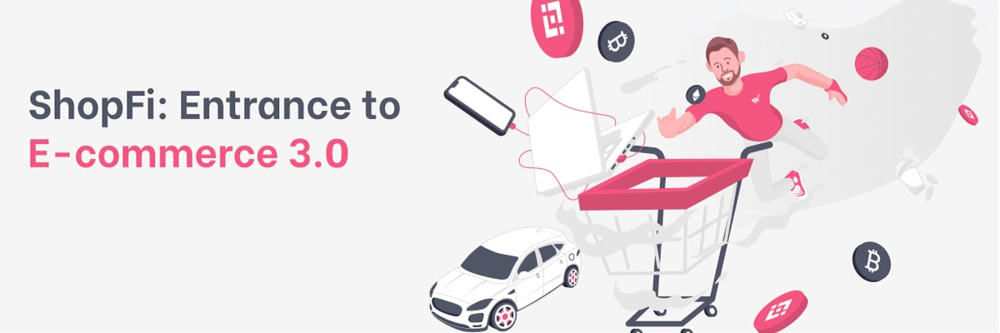

# ShopFi Global

## An entrance to e-commerce 3.0


ShopFi is a decentralized e-commerce platform that provides users a bridge between crypto world and major traditional e-commerce platforms. It allows users to buy products online with their cryptocurrencies without hassles.


### Abstract

This document tries to introduce the ideas and concepts of the ShopFi project, from different perspectives starting with the background, then markets and business model, then tokenomics and roadmap, etc.


**This version is only produced for the community to review and it's subject to change.**


### Links:

* Website: [https://shopfi.app](https://shopfi.app)
* Twitter: [https://twitter.com/shopfi\_app](https://twitter.com/shopfi\_app)
* Telegram: [https://t.me/shopfi\_official](https://t.me/shopfi\_official)
* Medium: [https://shopfi.medium.com/](https://shopfi.medium.com)
* Discord: [https://discord.gg/TUVqu5q68D](https://discord.gg/TUVqu5q68D)
* Github: [https://github.com/ShopFi-App](https://github.com/ShopFi-App)
