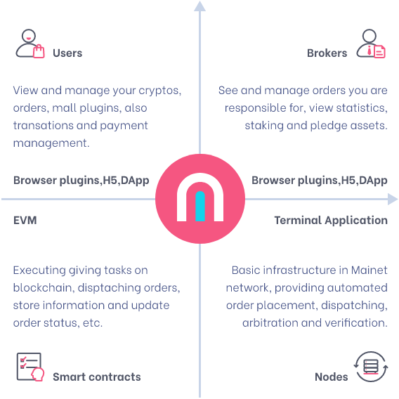

# ShopFi Products

ShopFi includes a series of products as below:

1. Smart contracts providing core, decentralized and storage functionalities to DApps.
2. DApps:
   1. Users: Chrome Plugin / Native Mobile App
   2. Brokers: Chrome Plugin / Native Mobile App
   3. Node operators: Terminal Apps
3. Connectors which connects traditional  e-commerce malls to ShopFi ecosystem.
   1. ShopFi team made.
   2. Dev community made.

